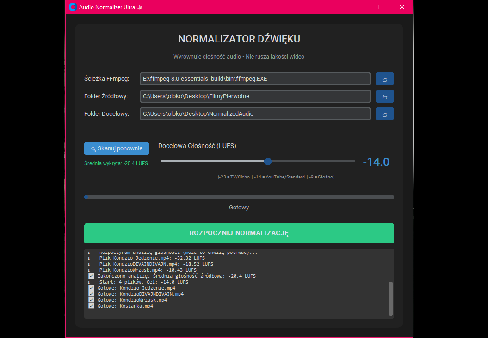

# Audio Normalizer



Aplikacja desktopowa do wsadowej normalizacji głośności w plikach wideo.\
Wyrównuje poziom dźwięku do standardów LUFS bez rekompresji obrazu — ścieżka wideo
jest kopiowana bit po bicie, więc jakość pozostaje 1:1.
 
## Funkcje
-   Bezstratne wideo — tryb `copy` dla strumienia wideo, zero utraty jakości
-   Normalizacja EBU R128 — filtr `loudnorm` z kontrolą True Peak i Loudness Range
-   Skanowanie plików — sprawdzenie aktualnej głośności przed przetwarzaniem
-   Suwak LUFS — wybór docelowego poziomu głośności
-   Nowoczesne GUI oparte na `customtkinter`
## Wymagania
-   Windows 10/11
-   FFmpeg — wskazany ręcznie w aplikacji lub dostępny w zmiennej `PATH`
-   Python 3.x oraz zależności z `requirements.txt` (tylko przy uruchamianiu z kodu)
## Instalacja
### 1. Pobierz gotowy plik `.exe`
Pobierz plik z zakładki **Releases**, uruchom i korzystaj.
 
------------------------------------------------------------------------
### 2. Zbuduj samodzielnie
Zainstaluj zależności:
``` bash
pip install -r requirements.txt
```
Uruchom build:
``` bash
build.bat
```
Gotowy plik znajdziesz w `dist/`.
 
------------------------------------------------------------------------
## Użycie
1.  Uruchom aplikację.
2.  Wskaż ścieżkę do `ffmpeg.exe` (jeśli nie wykryto automatycznie).
3.  Wybierz folder źródłowy i folder docelowy.
4.  Opcjonalnie kliknij **Skanuj pliki**, aby sprawdzić aktualną głośność nagrań.
5.  Ustaw docelowy poziom LUFS suwakiem:
    -   **-23 LUFS** — standard telewizyjny (EBU R128)
    -   **-14 LUFS** — zalecane dla internetu (YouTube, Spotify, podcasty)
    -   **-9 LUFS** — bardzo głośno (standard płyt CD)
6.  Kliknij **ROZPOCZNIJ NORMALIZACJĘ**.
------------------------------------------------------------------------
## Szczegóły techniczne
Parametry FFmpeg stosowane dla każdego pliku:
-   Wideo: `-c:v copy` (kopiowanie strumienia, zero rekompresji)
-   Audio: `-c:a aac -b:a 192k`
-   Filtr `loudnorm`:
    -   `I` — docelowa głośność zintegrowana (wartość z suwaka, domyślnie -14.0)
    -   `TP` = -1.5 dBTP (zabezpieczenie przed przesterami)
    -   `LRA` = 11 LU (zachowanie naturalnej dynamiki)
